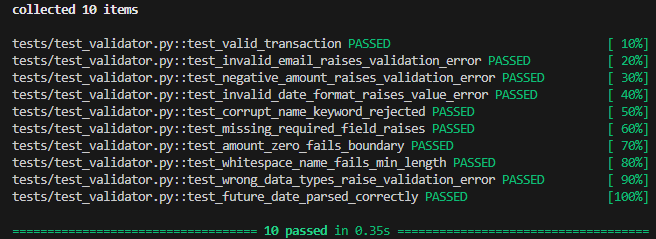

# Data Quality & Validation Pipeline

## 🎯 The Problem
In modern data architectures, "Garbage In, Garbage Out" is a major risk. Businesses lose thousands of dollars due to corrupt data feeding their BI tools or AI models. This project acts as a Data Gatekeeper, ensuring that only high-quality, schema-compliant data reaches the final destination.

## 🛠 Tech Stack
- **Python 3.10+**
- **Pandas**: High-performance data manipulation.
- **Pydantic(v2)**: Advanced schema enforcement and data sanitization.
- **Pytest**: Unit testing suite with 100% coverage on validation rules.
- **GitHub Actions**: CI/CD pipeline for automated quality assurance.

## 📁 Project Structure
- `src/`: Core logic and Pydantic models.
- `data/`: Raw, processed, and error report storage.
- `tests/`: Unit tests for data integrity.
- `.github/`: CI configuration.

## 🔧 Installation & Usage
1. Clone the repo: `git clone https://github.com/pattoor/Data-validation-pipeline.git`
2. Create environment virtual(optional): `python -m venv env`
3. Install dependencies: `pip install -r requirements.txt`
4. Run the generator: `python generate_raw_data.py`
5. Execute the pipeline: `python main.py`
6. Run tests: `python -m pytest -v`

## 📊 Features
- **Automated Validation**: Identifies missing values, wrong formats, and out-of-range numbers.
- **Error Reporting**: Generates a detailed `Validation_Errors.json` for data auditing.
- **CI/CD Integration**: Automated testing on every push.

**Authored by [Patricio Romero]** - Systems Engineering Student. 